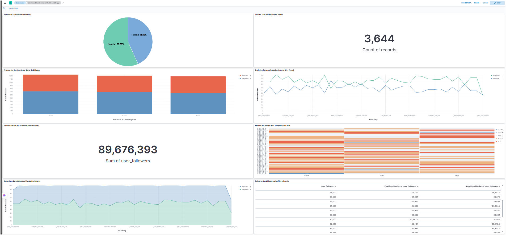

# Real-Time Sentiment Analysis Pipeline

An end-to-end Big Data streaming architecture designed to capture, process, and analyze public sentiment dynamics in real time. This pipeline utilizes Docker infrastructure to orchestrate a distributed messaging system and advanced search capabilities, fully integrated with automated text metrics processing.

## Infrastructure Architecture

The core of this system relies on a containerized environment managed via Docker Compose, handling high-throughput streaming events under peak volumes seamlessly:
*   **Apache Kafka**: Orchestrates the real-time event ingestion layer, acting as a highly available message bus.
*   **Apache Zookeeper**: Manages state, synchronization, and cluster consensus for the Kafka broker setup.
*   **Elasticsearch**: Serves as the primary analytical engine, distributed text search database, and low-latency metrics repository.
*   **Kibana**: Delivers an advanced data visualization environment mapped directly to Elasticsearch indices.

## Pipeline Operation Flow

The operational runtime is split into three concurrent data states:
1.  **Ingestion (`producer.py`)**: Continuously fetches mock public sentiment feeds categorized across multiple channels (Twitter, Reddit, News Sources) and streams messages to the dedicated Kafka topic.
2.  **Processing & NLP (`consumer.py`)**: Consumes the raw text stream from Kafka, runs immediate sentiment alignment filtering (Categorizing items into positive or negative vectors), evaluates profile metrics, and inserts structured JSON blocks directly into Elasticsearch.
3.  **Visualization Dashboard**: Kibana pulls index patterns dynamically to compute instant real-time charts.

##  Live Business Dashboard Analytics (Kibana Lens)

Here is the production-ready monitoring control panel capturing live metrics from the streaming data pipeline:

1. **Répartition Globale des Sentiments (Pie Chart)**
   * **What it shows:** Displays the macro-health of overall public perception f la capture d'écran (`43.22% Positive` vs `56.78% Negative`).
   * **Business Value:** Gives marketing teams an immediate, high-level understanding of user satisfaction trends at a single glance.

2. **Volume Total des Messages Traités (Metric Indicator)**
   * **What it shows:** An absolute counter evaluating real-time pipeline performance, showing exactly `3,644` total records ingested by Kafka and Elasticsearch.
   * **Business Value:** Provides system monitoring for data engineering teams to track end-to-end processing throughput and infrastructure scalability.

3. **Analyse des Sentiments par Canal de Diffusion (Stacked Bar Chart)**
   * **What it shows:** A side-by-side platform comparison breakdown across Reddit, Twitter, and News sources.
   * **Business Value:** Highlights which distribution channel contains the highest concentration of negative feedback, isolating target platforms that require strategic customer relations or PR intervention.

4. **Évolution Temporelle des Sentiments - Live Trend (Line Chart)**
   * **What it shows:** A dual-axis time-series visualization tracking continuous multi-second shifts for both positive and negative sentiment vectors.
   * **Business Value:** Vital for predictive brand safety, allowing teams to cross-examine chronological volatility and identify the exact moment a viral trend begins to pivot.

5. **Portée Cumulée de l'Audience - Reach Global (Metric Indicator)**
   * **What it shows:** A sum aggregate tracking total audience impact, capturing a massive total reach of `89,676,393` aggregated user followers.
   * **Business Value:** Evaluates brand exposure and penetration metrics to calculate the true mathematical weight and size of the audience exposed to the ongoing conversation.

6. **Matrice de Densité - Flux Temporel par Canal (Heatmap Mosaïque)**
   * **What it shows:** A dense density matrix correlating continuous timestamps against platforms (Reddit, Twitter, News), with deep orange cells representing high-volume frequency bursts.
   * **Business Value:** Helps optimize marketing outreach budgets by discovering structural viral hours where audience activity peaks on specific channels.

7. **Dynamique Cumulative des Flux de Sentiments (Area Stacked Chart)**
   * **What it shows:** A stacked surface area time-series representation displaying the proportion layer of positive vs. negative volume over time.
   * **Business Value:** Accurately gauges trend expansion rates, making it simple to detect if negative noise is expanding and overwhelming positive visibility over long intervals.

8. **Palmarès des Utilisateurs les Plus Influents (Leaderboard Data Table)**
   * **What it shows:** An advanced, multi-criteria structural ranking table cataloging user metrics by follower count thresholds linked directly to their respective median follower analytics.
   * **Business Value:** Isolates key opinion leaders, macro-influencers, or high-risk detractors instantly so the brand can target its high-priority influencer relations.
